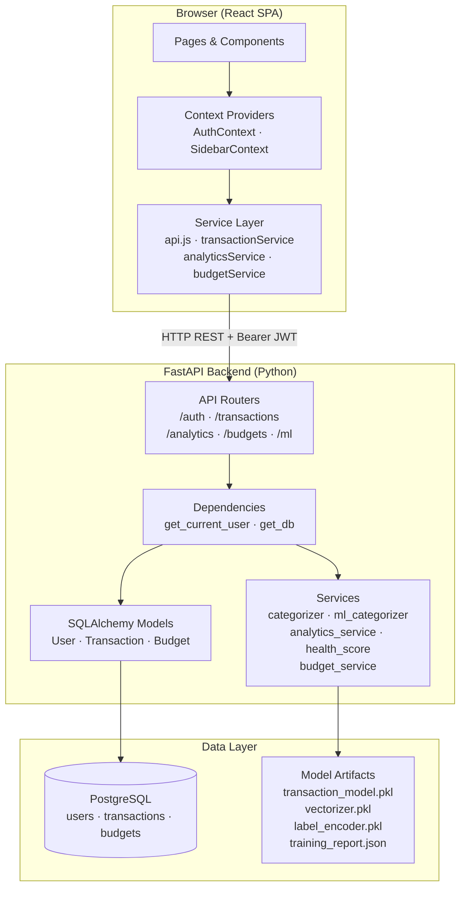
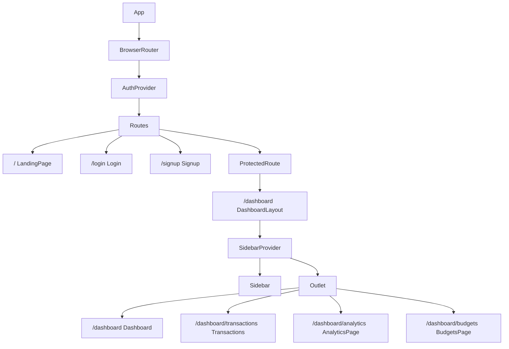
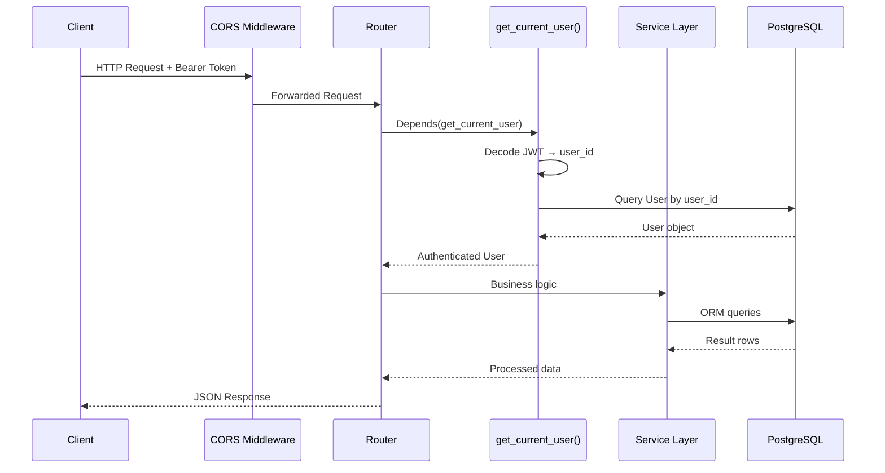
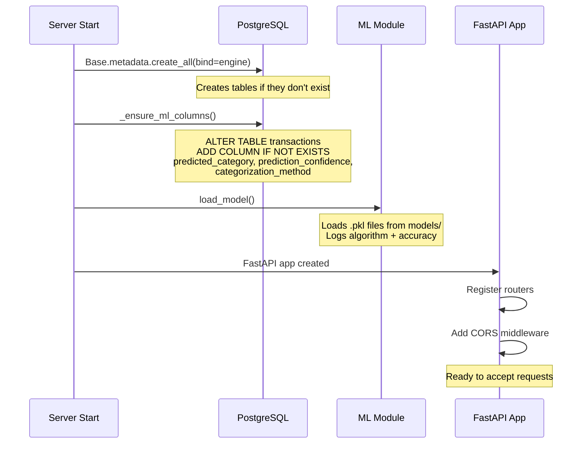
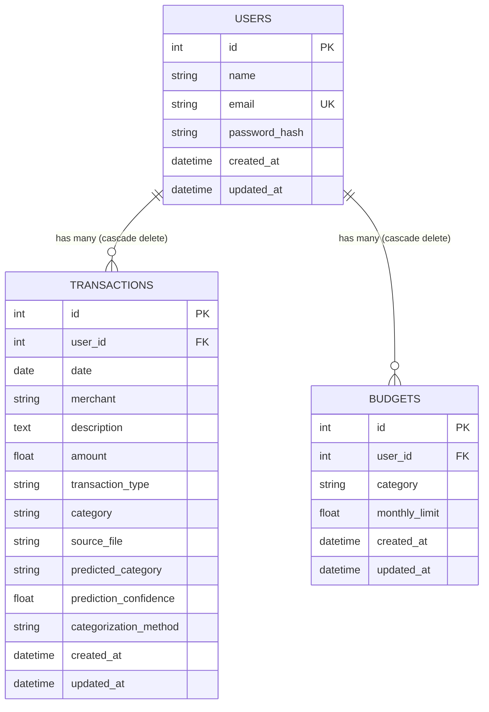
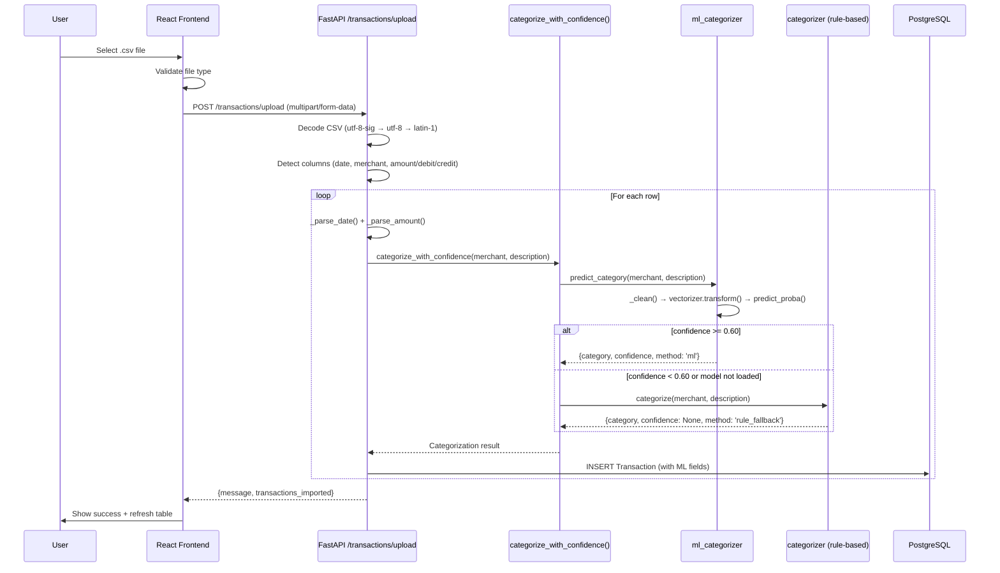
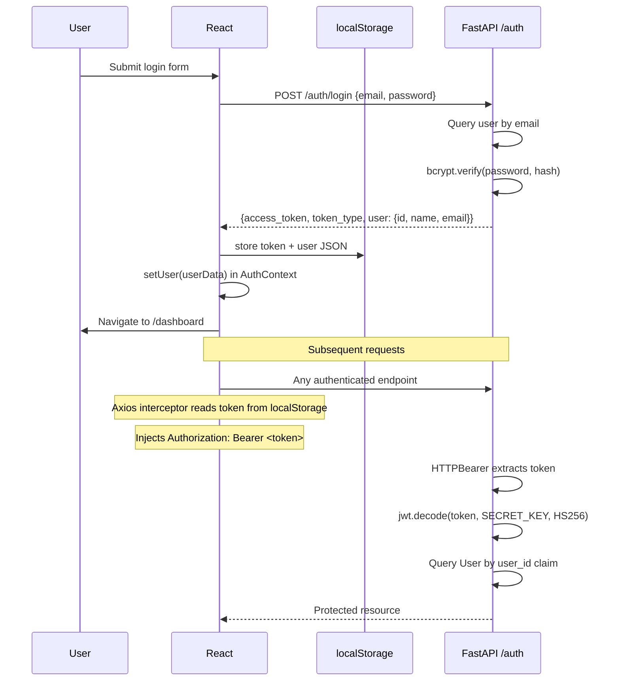

# FinMate — System Architecture

## Table of Contents

1. [High-Level Architecture](#high-level-architecture)
2. [Frontend Architecture](#frontend-architecture)
3. [Backend Architecture](#backend-architecture)
4. [Database Architecture](#database-architecture)
5. [ML Pipeline Architecture](#ml-pipeline-architecture)
6. [Data Flow Diagrams](#data-flow-diagrams)
7. [Complete Folder Structure](#complete-folder-structure)
8. [Technology Stack](#technology-stack)

---

## High-Level Architecture

FinMate is a monolithic full-stack application with a clear separation between a React SPA frontend and a FastAPI Python backend. The two communicate over a REST API. PostgreSQL serves as the persistence layer. A trained ML model (XGBoost) is loaded into backend memory at startup.



---

## Frontend Architecture

### Component Hierarchy



### State Management

FinMate uses React's built-in Context API for global state. There are no third-party state management libraries.

| Context | State Held | Persistence |
|---------|-----------|-------------|
| `AuthContext` | `user` object (id, name, email) | `localStorage` (`user`, `token`) |
| `SidebarContext` | `collapsed` boolean, `mobileOpen` boolean | `localStorage` (`fm-sidebar`) |

All page-level state (transactions list, budgets, analytics data) is local `useState` — fetched on mount, not cached globally.

### Routing Architecture

```mermaid
graph LR
    "/" --> LandingPage
    "/login" --> AuthRoute --> Login
    "/signup" --> AuthRoute --> Signup
    "/dashboard/*" --> ProtectedRoute --> DashboardLayout

    DashboardLayout --> "/dashboard" --> Dashboard
    DashboardLayout --> "/dashboard/transactions" --> Transactions
    DashboardLayout --> "/dashboard/analytics" --> AnalyticsPage
    DashboardLayout --> "/dashboard/budgets" --> BudgetsPage
    "*" --> Redirect[Redirect to /]
```

**AuthRoute**: Redirects logged-in users away from `/login` and `/signup` to `/dashboard`.  
**ProtectedRoute**: Redirects unauthenticated users from any `/dashboard/*` route to `/login`.

### Service Layer (API Client)

All HTTP communication is centralized through a single Axios instance (`src/services/api.js`) configured with:
- `baseURL: 'http://localhost:8000'`
- Request interceptor that reads `token` from `localStorage` and injects `Authorization: Bearer <token>` on every request.

Domain-specific service modules wrap individual API calls:

```
services/
├── api.js                 # Axios instance + auth interceptor
├── transactionService.js  # upload, getTransactions, getSummary, getCategories
├── analyticsService.js    # getOverview, getMonthlyTrend, getCategoryBreakdown,
│                          # getTopMerchants, getCashflow, getHeatmap, getHealthScore
└── budgetService.js       # getBudgets, getBudgetOverview, getBudgetForecast,
                           # createBudget, updateBudget, deleteBudget
```

---

## Backend Architecture

### Request Lifecycle



### Module Organization

```
backend/
├── main.py                        # App factory, CORS, startup hooks
├── requirements.txt
├── .env                           # DATABASE_URL, SECRET_KEY, ALGORITHM
├── models/                        # ML model artifacts (generated, not source-controlled)
│   ├── transaction_model.pkl
│   ├── vectorizer.pkl
│   ├── label_encoder.pkl
│   └── training_report.json
├── data/
│   └── transactions_train.csv     # 889-sample training dataset
├── scripts/
│   ├── train_transaction_classifier.py
│   └── migrate_add_ml_columns.py
└── app/
    ├── models/                    # SQLAlchemy ORM models
    │   ├── __init__.py
    │   ├── user.py
    │   ├── transaction.py
    │   └── budget.py
    ├── schemas/                   # Pydantic request/response models
    │   ├── user.py
    │   ├── transaction.py
    │   ├── budget.py
    │   └── analytics.py
    ├── routes/                    # FastAPI APIRouter instances
    │   ├── auth.py
    │   ├── transactions.py
    │   ├── analytics.py
    │   ├── budgets.py
    │   ├── ml.py
    │   └── test.py
    ├── services/                  # Business logic
    │   ├── categorizer.py
    │   ├── ml_categorizer.py
    │   ├── analytics_service.py
    │   ├── health_score_service.py
    │   └── budget_service.py
    ├── database/
    │   ├── database.py            # Engine, SessionLocal, Base
    │   └── dependencies.py       # get_db() generator
    ├── utils/
    │   └── auth.py               # bcrypt, JWT helpers
    └── dependencies.py           # get_current_user() FastAPI dependency
```

### Startup Sequence



---

## Database Architecture

### Entity-Relationship Diagram



### Table Indexes

| Table | Column | Index Type | Purpose |
|-------|--------|-----------|---------|
| `users` | `id` | Primary Key | Row lookup |
| `users` | `email` | Unique | Duplicate prevention, login |
| `transactions` | `id` | Primary Key | Row lookup |
| `transactions` | `user_id` | Index | Filter transactions per user |
| `budgets` | `id` | Primary Key | Row lookup |
| `budgets` | `user_id` | Index | Filter budgets per user |

---

## ML Pipeline Architecture

### Training Pipeline

```mermaid
flowchart TD
    CSV[transactions_train.csv<br/>889 rows, merchant_name + category] --> CLEAN[clean_merchant&#40;&#41;<br/>Normalize text]
    CLEAN --> SPLIT[80/20 Stratified Split<br/>711 train / 178 test]
    SPLIT --> TFIDF[build_vectorizer&#40;&#41;<br/>TF-IDF FeatureUnion<br/>Word 1-2grams &#43; Char 3-5grams]
    TFIDF --> XGB[XGBClassifier<br/>n_estimators=300, max_depth=6<br/>learning_rate=0.1, subsample=0.8]
    XGB --> EVAL[Evaluate<br/>accuracy, precision, recall, F1]
    EVAL --> PKL[Serialize with joblib<br/>transaction_model.pkl<br/>vectorizer.pkl<br/>label_encoder.pkl]
    EVAL --> JSON[training_report.json<br/>metrics + metadata]
```



### Inference Pipeline (Per Transaction)

```mermaid
flowchart TD
    TXN[merchant + description] --> CLEAN2[_clean&#40;&#41;<br/>lowercase, strip prefixes,<br/>remove numbers, non-alpha]
    CLEAN2 --> LOADED{Model loaded?}
    LOADED -->|No| RULE[Rule Engine<br/>categorize&#40;&#41;<br/>Keyword matching]
    LOADED -->|Yes| VEC[vectorizer.transform&#40;&#41;<br/>TF-IDF sparse matrix]
    VEC --> PRED[model.predict_proba&#40;&#41;<br/>15-class probabilities]
    PRED --> CONF{confidence >= 0.60?}
    CONF -->|Yes| ML_CAT[ML Category + confidence<br/>method: 'ml']
    CONF -->|No| RULE
    RULE --> RULE_CAT[Rule Category<br/>confidence: None<br/>method: 'rule_fallback']
```



---

## Data Flow Diagrams

### CSV Upload Flow



### Authentication Flow



---

## Complete Folder Structure

```
finmate/
├── backend/
│   ├── main.py                         # FastAPI entry point, startup hooks, router registration
│   ├── requirements.txt                # Python dependencies
│   ├── .env                            # DATABASE_URL, SECRET_KEY, ALGORITHM
│   ├── models/                         # Generated ML artifacts (gitignore'd)
│   │   ├── transaction_model.pkl       # Trained XGBoost classifier (~4.3 MB)
│   │   ├── vectorizer.pkl              # TF-IDF FeatureUnion (word + char ngrams)
│   │   ├── label_encoder.pkl           # LabelEncoder for 15 categories
│   │   └── training_report.json        # Accuracy, per-class metrics, metadata
│   ├── data/
│   │   └── transactions_train.csv      # 889 labeled merchant→category training samples
│   ├── scripts/
│   │   ├── train_transaction_classifier.py  # Full training pipeline (CLI)
│   │   └── migrate_add_ml_columns.py        # Standalone DB migration script
│   └── app/
│       ├── __init__.py
│       ├── models/
│       │   ├── __init__.py             # Exports User, Transaction, Budget
│       │   ├── user.py                 # User SQLAlchemy model
│       │   ├── transaction.py          # Transaction model + ML columns
│       │   └── budget.py               # Budget model
│       ├── schemas/
│       │   ├── user.py                 # UserCreate, UserLogin Pydantic models
│       │   ├── transaction.py          # TransactionResponse, Upload/Summary/List responses
│       │   ├── budget.py               # BudgetCreate/Update/Response/WithProgress/Forecast
│       │   └── analytics.py            # Overview/Monthly/Category/Heatmap/HealthScore schemas
│       ├── routes/
│       │   ├── auth.py                 # POST /auth/signup, POST /auth/login
│       │   ├── transactions.py         # POST /upload, GET /, GET /summary, GET /categories
│       │   ├── analytics.py            # GET /overview through /health-score (7 endpoints)
│       │   ├── budgets.py              # CRUD + /overview + /forecast (7 endpoints)
│       │   ├── ml.py                   # GET /ml/model-info
│       │   └── test.py                 # Health check (dev use)
│       ├── services/
│       │   ├── categorizer.py          # Rule-based categorize() + categorize_with_confidence()
│       │   ├── ml_categorizer.py       # load_model(), predict_category(), is_loaded()
│       │   ├── analytics_service.py    # Pure functions for all analytics calculations
│       │   ├── health_score_service.py # compute_health_score() — weighted 4-component score
│       │   └── budget_service.py       # compute_budget_progress(), compute_forecast(), generate_alerts()
│       ├── database/
│       │   ├── database.py             # create_engine(), SessionLocal, Base
│       │   └── dependencies.py         # get_db() dependency generator
│       ├── utils/
│       │   └── auth.py                 # hash_password(), verify_password(), create_access_token()
│       └── dependencies.py             # get_current_user() FastAPI dependency

├── frontend/
│   ├── package.json
│   ├── vite.config.js
│   ├── postcss.config.js
│   ├── tailwind.config.js
│   ├── index.html
│   └── src/
│       ├── main.jsx                    # React DOM render root
│       ├── App.jsx                     # BrowserRouter, route definitions, AuthRoute guard
│       ├── context/
│       │   ├── AuthContext.jsx         # user state, login(), logout(), useAuth()
│       │   └── SidebarContext.jsx      # collapsed state, toggle(), mobile controls
│       ├── components/
│       │   ├── ProtectedRoute/
│       │   │   └── ProtectedRoute.jsx  # Redirects unauthenticated to /login
│       │   ├── layout/
│       │   │   └── NavBar.jsx          # Shared navbar (landing page)
│       │   └── ui/
│       │       └── Button.jsx          # Shared button primitive
│       ├── pages/
│       │   ├── LandingPage/
│       │   │   ├── LandingPage.jsx     # Composes all landing sections
│       │   │   └── components/
│       │   │       ├── Navbar/Navbar.jsx
│       │   │       ├── Hero/Hero.jsx
│       │   │       ├── Features/Features.jsx
│       │   │       ├── HowItWorks/HowItWorks.jsx
│       │   │       ├── AIShowcase/AIShowcase.jsx
│       │   │       ├── Trust/Trust.jsx
│       │   │       ├── CTASection/CTASection.jsx
│       │   │       └── Footer/Footer.jsx
│       │   ├── Login/
│       │   │   └── Login.jsx
│       │   ├── Signup/
│       │   │   └── Signup.jsx
│       │   ├── Dashboard/
│       │   │   ├── DashboardLayout.jsx # Shell: Sidebar + <Outlet /> + mobile overlay
│       │   │   ├── DashboardLayout.css
│       │   │   ├── Dashboard.jsx       # Main dashboard page
│       │   │   ├── Dashboard.css
│       │   │   └── components/
│       │   │       ├── Sidebar.jsx     # Collapsible nav + user info
│       │   │       ├── Topbar.jsx      # Page title + mobile toggle
│       │   │       ├── StatsCard.jsx   # KPI card with icon + trend
│       │   │       ├── TransactionTable.jsx  # Recent transactions mini-table
│       │   │       ├── SpendingChart.jsx     # Area chart (mock data)
│       │   │       ├── AIInsights.jsx        # Static insight cards
│       │   │       └── BudgetProgress.jsx    # Static budget progress bars
│       │   ├── Transactions/
│       │   │   ├── Transactions.jsx    # Full transaction management page
│       │   │   ├── Transactions.css
│       │   │   └── components/
│       │   │       └── UploadModal/
│       │   │           ├── UploadModal.jsx   # Drag-drop CSV upload modal
│       │   │           └── UploadModal.css
│       │   ├── Analytics/
│       │   │   ├── AnalyticsPage.jsx   # Composes all analytics widgets
│       │   │   ├── AnalyticsPage.css
│       │   │   └── components/
│       │   │       ├── HealthScoreCard.jsx     # Circular gauge + breakdown
│       │   │       ├── MonthlyTrendChart.jsx   # Area chart (12 months)
│       │   │       ├── CategoryBreakdownChart.jsx # Donut + table
│       │   │       ├── CashflowChart.jsx       # Dual-area income vs expense
│       │   │       ├── SpendingHeatmap.jsx      # Day-of-week bar chart
│       │   │       ├── TopMerchantsTable.jsx    # Top 5 merchants table
│       │   │       └── HealthInsights.jsx       # Text insights list
│       │   └── Budgets/
│       │       ├── BudgetsPage.jsx     # Budget management page
│       │       ├── BudgetsPage.css
│       │       └── components/
│       │           ├── BudgetCard.jsx         # Individual budget with progress bar
│       │           ├── BudgetForecast.jsx     # End-of-month projection table
│       │           ├── BudgetAlerts.jsx       # Alert banners from forecast
│       │           └── CreateBudgetModal.jsx  # Create/edit budget form
│       └── services/
│           ├── api.js                  # Axios instance + Bearer token interceptor
│           ├── transactionService.js
│           ├── analyticsService.js
│           └── budgetService.js

└── docs/                               # This documentation directory
    ├── FinMate_Architecture.md
    ├── FinMate_API_Documentation.md
    ├── FinMate_Database_Documentation.md
    ├── FinMate_ML_Documentation.md
    ├── FinMate_User_Guide.md
    ├── FinMate_Developer_Guide.md
    └── FinMate_Full_Documentation.md
```

---

## Technology Stack

### Backend

| Technology | Version | Role |
|-----------|---------|------|
| Python | 3.10+ | Runtime |
| FastAPI | ≥0.100.0 | Web framework, auto OpenAPI docs |
| Uvicorn | ≥0.20.0 | ASGI server |
| SQLAlchemy | ≥2.0.0 | ORM, query builder |
| PostgreSQL | 14+ | Primary database |
| psycopg2-binary | ≥2.9.0 | PostgreSQL driver |
| Pydantic | ≥2.0.0 | Data validation, serialization |
| passlib[bcrypt] | ≥1.7.4 | Password hashing |
| python-jose | ≥3.3.0 | JWT encoding/decoding |
| python-dotenv | ≥1.0.0 | `.env` file loading |
| python-multipart | ≥0.0.6 | File upload support |
| scikit-learn | ≥1.3.0 | TF-IDF vectorization, pipeline |
| xgboost | ≥2.0.0 | Gradient boosting classifier |
| pandas | ≥2.0.0 | DataFrame operations in training |
| numpy | ≥1.24.0 | Numerical operations |
| joblib | ≥1.3.0 | Model serialization |

### Frontend

| Technology | Version | Role |
|-----------|---------|------|
| React | 19.2.0 | UI library |
| React DOM | 19.2.0 | DOM rendering |
| React Router DOM | 7.9.6 | Client-side routing |
| Vite | 7.2.4 | Build tool, dev server |
| Axios | 1.17.0 | HTTP client |
| Recharts | 3.8.1 | Data visualization charts |
| Lucide React | 1.17.0 | Icon library |
| Framer Motion | 12.23.25 | Animations |
| Tailwind CSS | 3.4.14 | Utility CSS framework |
| PostCSS | 8.5.6 | CSS processing |
| Autoprefixer | 10.4.22 | CSS vendor prefixes |
