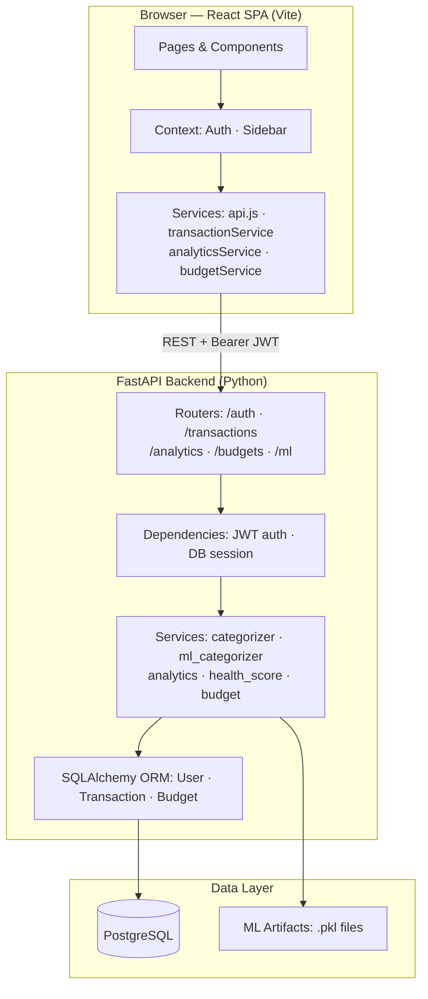
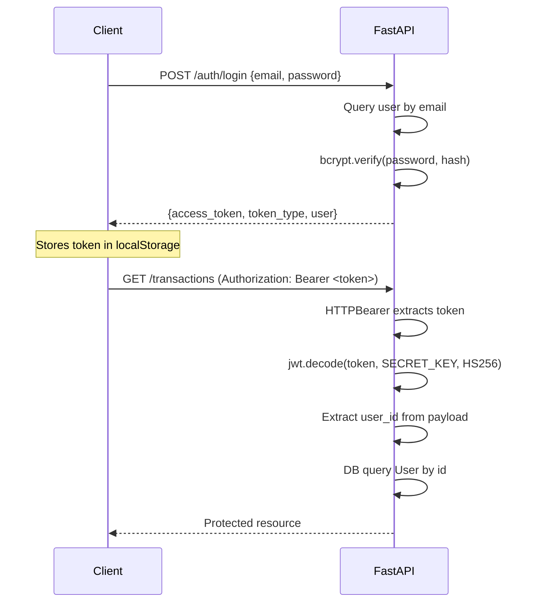
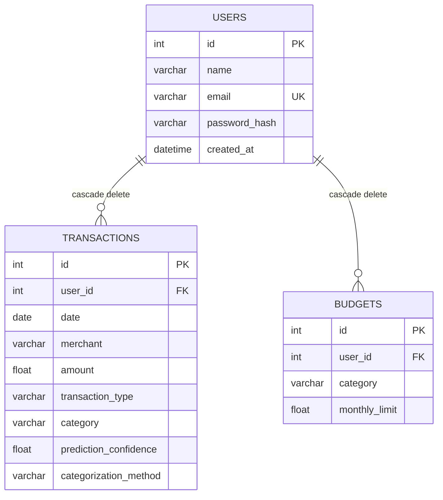

# FinMate — Complete Technical Documentation

**Version:** 1.0  
**Date:** June 2025  
**Stack:** React 19 · FastAPI · PostgreSQL · XGBoost · TF-IDF

---

## Table of Contents

1. [Executive Summary](#1-executive-summary)
2. [System Architecture](#2-system-architecture)
3. [Complete Folder Structure](#3-complete-folder-structure)
4. [Frontend Documentation](#4-frontend-documentation)
5. [Backend Documentation](#5-backend-documentation)
6. [Authentication System](#6-authentication-system)
7. [Database Documentation](#7-database-documentation)
8. [Transaction Pipeline](#8-transaction-pipeline)
9. [Analytics Engine](#9-analytics-engine)
10. [Budget System](#10-budget-system)
11. [ML Categorization Engine](#11-ml-categorization-engine)
12. [Complete API Reference](#12-complete-api-reference)
13. [Developer Setup Guide](#13-developer-setup-guide)
14. [Deployment Guide](#14-deployment-guide)
15. [Technical Interview Q&A](#15-technical-interview-qa)
16. [Future Roadmap](#16-future-roadmap)
17. [Documentation Statistics](#17-documentation-statistics)

---

# 1. Executive Summary

## What Is FinMate?

FinMate is an **AI-powered personal finance management platform** that helps individuals track, analyze, and optimize their spending. Users import bank statement CSV files, and FinMate automatically parses, categorizes, and visualizes every transaction using a combination of machine learning and rule-based analysis.

## Problem Statement

Most working professionals in India struggle with:
- **Lack of visibility** into where their money actually goes
- **Manual effort** required to categorize bank transactions
- **No actionable feedback** on financial health
- **Reactive budgeting** — realizing overspending only after the month ends

Generic spreadsheet solutions exist, but they require significant manual data entry and categorization effort. Existing finance apps are either overly simplistic or lock users into proprietary ecosystems.

## Solution

FinMate solves these problems by:
1. **Automatic categorization** — Upload a CSV, every transaction is tagged with a spending category using an XGBoost ML model (15 categories, 69%+ accuracy + rule fallback)
2. **Real-time analytics** — 7 analytics views including monthly trends, category breakdown, cashflow analysis, and day-of-week spending heatmap
3. **Financial health score** — Composite 0–100 score with personalized insights, calculated from savings rate, expense stability, income consistency, and category diversification
4. **Budget tracking with forecasting** — Set monthly spending caps per category, see real-time progress, and get end-of-month projections before you overspend

## Key Capabilities

| Capability | Technology | Details |
|-----------|-----------|---------|
| ML Transaction Categorization | XGBoost + TF-IDF | 15 categories, 69.1% accuracy, 0.60 confidence threshold |
| Rule-Based Fallback | Keyword matching | 14 categories, 100s of keywords |
| CSV Import | Python csv module | 8+ date formats, flexible column detection |
| Financial Health Score | Statistical algorithms | 4 components, 0–100 scale, grades A+–D |
| Budget Forecasting | Linear projection | Daily rate extrapolation to month-end |
| Real-Time Analytics | SQLAlchemy aggregations | 7 endpoints, pure Python computations |
| Authentication | JWT + bcrypt | 24-hour tokens, HTTPBearer scheme |
| Responsive UI | React + CSS | Collapsible sidebar, mobile-friendly |

---

# 2. System Architecture

## High-Level Architecture



## Frontend Architecture

**Framework:** React 19 with Vite  
**Routing:** React Router DOM 7 (client-side SPA)  
**State:** React Context API (AuthContext, SidebarContext)  
**HTTP:** Axios with Bearer token interceptor  
**Charts:** Recharts  
**Icons:** Lucide React  
**Animations:** Framer Motion  
**CSS:** Tailwind CSS + custom CSS modules per page

### Route Map

```
/                         → LandingPage (public)
/login                    → Login (AuthRoute: redirect if logged in)
/signup                   → Signup (AuthRoute: redirect if logged in)
/dashboard                → DashboardLayout (ProtectedRoute)
  /dashboard              → Dashboard (index)
  /dashboard/transactions → Transactions
  /dashboard/analytics    → AnalyticsPage
  /dashboard/budgets      → BudgetsPage
*                         → Redirect to /
```

## Backend Architecture

**Framework:** FastAPI  
**ASGI Server:** Uvicorn  
**ORM:** SQLAlchemy 2.0  
**Database:** PostgreSQL  
**Authentication:** JWT via python-jose, passwords via passlib/bcrypt  
**ML:** scikit-learn (TF-IDF), XGBoost, joblib

### Request Flow

```
Request → CORS Middleware → Router → Depends(get_current_user)
       → JWT decode → User lookup → Route handler
       → Service layer → ORM query → PostgreSQL
       → Pydantic serialization → JSON Response
```

## Data Flow: CSV Upload

```
User selects CSV → Frontend validates → POST /transactions/upload
→ Backend decodes bytes → csv.DictReader → _find_column() detection
→ Per row: _parse_date() + _parse_amount()
→ categorize_with_confidence(merchant, description)
  → ml_categorizer.predict_category() → TF-IDF → XGBoost → proba
  → if proba >= 0.60: return ML result
  → else: categorize() rule engine → keyword match
→ Transaction ORM object → db.add() → db.commit()
→ Return {transactions_imported: N}
→ Frontend refreshes table
```

---

# 3. Complete Folder Structure

```
finmate/
├── backend/
│   ├── main.py                              FastAPI app, startup, router registration
│   ├── requirements.txt                     Python package dependencies
│   ├── .env                                 DATABASE_URL, SECRET_KEY, ALGORITHM
│   ├── models/                              Generated ML artifacts (not in git)
│   │   ├── transaction_model.pkl            XGBoost classifier (~4.3 MB)
│   │   ├── vectorizer.pkl                   TF-IDF FeatureUnion
│   │   ├── label_encoder.pkl                Category string ↔ int mapping
│   │   └── training_report.json             Accuracy + per-class metrics
│   ├── data/
│   │   └── transactions_train.csv           889-sample training dataset
│   ├── scripts/
│   │   ├── train_transaction_classifier.py  Training pipeline CLI
│   │   └── migrate_add_ml_columns.py        Standalone DB migration
│   └── app/
│       ├── __init__.py
│       ├── models/
│       │   ├── __init__.py                  Exports User, Transaction, Budget
│       │   ├── user.py                      User SQLAlchemy model
│       │   ├── transaction.py               Transaction model (12 columns)
│       │   └── budget.py                    Budget model (5 columns)
│       ├── schemas/
│       │   ├── user.py                      UserCreate, UserLogin
│       │   ├── transaction.py               TransactionResponse, Upload/Summary/List
│       │   ├── budget.py                    Budget Create/Update/Response/Forecast
│       │   └── analytics.py                 All 7 analytics response schemas
│       ├── routes/
│       │   ├── auth.py                      POST /auth/signup, /auth/login
│       │   ├── transactions.py              POST /upload, GET /, /summary, /categories
│       │   ├── analytics.py                 GET /overview through /health-score
│       │   ├── budgets.py                   CRUD + /overview + /forecast
│       │   ├── ml.py                        GET /ml/model-info
│       │   └── test.py                      Dev health check
│       ├── services/
│       │   ├── categorizer.py               categorize() + categorize_with_confidence()
│       │   ├── ml_categorizer.py            load_model(), predict_category(), is_loaded()
│       │   ├── analytics_service.py         6 pure-function analytics calculators
│       │   ├── health_score_service.py      compute_health_score() — 4-component algorithm
│       │   └── budget_service.py            compute_budget_progress(), forecast(), alerts()
│       ├── database/
│       │   ├── database.py                  Engine, SessionLocal, Base
│       │   └── dependencies.py              get_db() generator
│       ├── utils/
│       │   └── auth.py                      hash_password(), verify_password(), JWT
│       └── dependencies.py                  get_current_user() FastAPI dependency

└── frontend/
    ├── package.json
    ├── vite.config.js
    ├── tailwind.config.js
    ├── index.html
    └── src/
        ├── main.jsx                         ReactDOM.createRoot
        ├── App.jsx                          Routes + AuthProvider + AuthRoute guard
        ├── context/
        │   ├── AuthContext.jsx              user state, login(), logout()
        │   └── SidebarContext.jsx           collapsed, toggle(), mobile controls
        ├── components/
        │   ├── ProtectedRoute/ProtectedRoute.jsx
        │   ├── layout/NavBar.jsx
        │   └── ui/Button.jsx
        ├── pages/
        │   ├── LandingPage/LandingPage.jsx  + 7 section components
        │   ├── Login/Login.jsx
        │   ├── Signup/Signup.jsx
        │   ├── Dashboard/
        │   │   ├── DashboardLayout.jsx      Shell with Sidebar + Outlet
        │   │   ├── Dashboard.jsx            Summary cards + charts + recent txns
        │   │   └── components/
        │   │       ├── Sidebar.jsx          Collapsible navigation
        │   │       ├── Topbar.jsx           Page title + mobile toggle
        │   │       ├── StatsCard.jsx        KPI card component
        │   │       ├── TransactionTable.jsx Mini transaction list
        │   │       ├── SpendingChart.jsx    Area chart
        │   │       ├── AIInsights.jsx       Insight cards
        │   │       └── BudgetProgress.jsx   Budget mini-cards
        │   ├── Transactions/
        │   │   ├── Transactions.jsx         Full transaction page
        │   │   └── components/UploadModal/  CSV upload flow
        │   ├── Analytics/
        │   │   ├── AnalyticsPage.jsx        7 analytics widgets
        │   │   └── components/
        │   │       ├── HealthScoreCard.jsx
        │   │       ├── MonthlyTrendChart.jsx
        │   │       ├── CategoryBreakdownChart.jsx
        │   │       ├── CashflowChart.jsx
        │   │       ├── SpendingHeatmap.jsx
        │   │       ├── TopMerchantsTable.jsx
        │   │       └── HealthInsights.jsx
        │   └── Budgets/
        │       ├── BudgetsPage.jsx          Budget management
        │       └── components/
        │           ├── BudgetCard.jsx
        │           ├── BudgetForecast.jsx
        │           ├── BudgetAlerts.jsx
        │           └── CreateBudgetModal.jsx
        └── services/
            ├── api.js                       Axios + token interceptor
            ├── transactionService.js
            ├── analyticsService.js
            └── budgetService.js
```

---

# 4. Frontend Documentation

## 4.1 Landing Page

**Route:** `/`  
**File:** `src/pages/LandingPage/LandingPage.jsx`  
**Access:** Public

**Purpose:** Marketing page that introduces FinMate and directs visitors to sign up or log in.

**Section Components:**

| Component | Purpose |
|-----------|---------|
| `Navbar` | Top navigation with logo, Login link, Get Started CTA |
| `Hero` | Main headline, sub-headline, primary CTA button |
| `Features` | 3 feature cards: AI categorization, analytics, budgeting |
| `HowItWorks` | 3-step process: Upload → Categorize → Insights |
| `AIShowcase` | Visual preview of analytics/health score |
| `Trust` | Security and privacy messaging |
| `CTASection` | Final sign-up call to action |
| `Footer` | Navigation links |

**State:** None — fully static.  
**API integrations:** None.

---

## 4.2 Login Page

**Route:** `/login`  
**File:** `src/pages/Login/Login.jsx`  
**Access:** `AuthRoute` — redirects to `/dashboard` if already logged in

**State:**
- `email`, `password` — form field values
- `error` — error message to display
- `loading` — button disabled during API call

**User workflow:**
1. Enter email and password
2. Submit form → `POST /auth/login`
3. On success: `login(user, token)` saves to localStorage, navigate to `/dashboard`
4. On failure: display error message

---

## 4.3 Signup Page

**Route:** `/signup`  
**File:** `src/pages/Signup/Signup.jsx`  
**Access:** `AuthRoute`

**State:**
- `name`, `email`, `password`, `confirmPassword` — form fields
- `agreed` — terms checkbox
- `error` — validation/API error
- `loading` — submit state

**Client-side validation:**
- All fields required
- Email format validation (via Pydantic on server; basic on client)
- Passwords must match
- Terms must be accepted

---

## 4.4 Dashboard (Home)

**Route:** `/dashboard`  
**File:** `src/pages/Dashboard/Dashboard.jsx`  
**Access:** Protected (JWT required)

**State:**
- `summary` — transaction summary data from API
- `recentTransactions` — last 5 transactions
- `loading` — loading state

**API calls on mount (parallel):**
- `getTransactionSummary()` → stats cards
- `getTransactions({ limit: 5 })` → recent transactions table

**Components rendered:**
- `Topbar` with title "Dashboard"
- `StatsCard` × 4: Monthly Spending, Net Savings, Top Category, Transactions
- `SpendingChart` — area chart (static mock data, 6 months)
- `AIInsights` — 4 static insight cards
- `TransactionTable` — 5 most recent transactions
- `BudgetProgress` — static budget progress bars

---

## 4.5 Transactions Page

**Route:** `/dashboard/transactions`  
**File:** `src/pages/Transactions/Transactions.jsx`  
**Access:** Protected

**State:**
- `transactions` — current page of transaction data
- `categories` — distinct category list for filter dropdown
- `summary` — stats cards data
- `page`, `totalPages`, `total` — pagination state
- `searchInput`, `search` — search with 350ms debounce
- `category`, `month`, `year` — active filter values
- `refreshKey` — incremented after upload to force re-fetch
- `uploadOpen` — upload modal visibility

**API calls:**
- `getTransactionSummary()` on mount and after upload
- `getCategories()` on mount and after upload
- `getTransactions(params)` on page/filter changes
- `uploadStatement(file)` via UploadModal

**Key features:**
- 20 items per page pagination
- Combined search + category + month + year filtering
- 350ms search debounce (prevents API spam while typing)
- ML confidence badge (shows `XX%` only when `categorization_method === 'ml'`)
- Skeleton loaders while fetching
- Empty states for no data and no search results

---

## 4.6 Analytics Page

**Route:** `/dashboard/analytics`  
**File:** `src/pages/Analytics/AnalyticsPage.jsx`  
**Access:** Protected

**State:**
- `overview`, `monthlyTrend`, `categoryBreakdown`, `topMerchants`, `cashflow`, `heatmap`, `healthScore`
- `loading` — set false after all 7 API calls complete

**API calls (all parallel via `Promise.all`):**
1. `getOverview()` → stats cards
2. `getMonthlyTrend()` → MonthlyTrendChart
3. `getCategoryBreakdown()` → CategoryBreakdownChart
4. `getTopMerchants()` → TopMerchantsTable
5. `getCashflow()` → CashflowChart
6. `getHeatmap()` → SpendingHeatmap
7. `getHealthScore()` → HealthScoreCard + HealthInsights

**Page layout (5 rows):**
1. Health Score card (left) + 4 overview StatsCards (right)
2. Monthly Trend area chart (full width)
3. Category Breakdown donut (left) + Top Merchants table (right)
4. Cashflow dual-area chart (full width)
5. Spending Heatmap (left) + Health Insights (right)

---

## 4.7 Budgets Page

**Route:** `/dashboard/budgets`  
**File:** `src/pages/Budgets/BudgetsPage.jsx`  
**Access:** Protected

**State:**
- `budgets` — list of budget + progress objects
- `overview` — aggregate stats
- `forecast` — projection + alerts
- `loading`, `error`
- `showModal`, `editBudget` — create/edit modal state

**API calls (parallel):**
- `getBudgets()` → budget cards
- `getBudgetOverview()` → stats cards
- `getBudgetForecast()` → forecast table + alerts

**User workflows:**
1. **View budgets** — see real-time spend vs limit cards
2. **Create budget** — click "Add Budget" → modal → select category + set limit → `POST /budgets`
3. **Edit budget** — click edit icon on card → same modal pre-filled → `PUT /budgets/{id}`
4. **Delete budget** — click delete icon → `DELETE /budgets/{id}` → list refreshes
5. **View forecast** — forecast table + alert banners automatically shown

**Components:**
- `BudgetAlerts` — alert banners for at-risk/exceeded budgets
- `BudgetCard` — individual budget with progress bar, risk badge, edit/delete
- `BudgetForecast` — tabular end-of-month projection
- `CreateBudgetModal` — create/edit form with category dropdown

---

## 4.8 Shared Components

### DashboardLayout (`pages/Dashboard/DashboardLayout.jsx`)

The shell component for all `/dashboard/*` routes. Renders `Sidebar` + `<Outlet />` + mobile overlay. Wraps children in `SidebarProvider`.

### Sidebar (`pages/Dashboard/components/Sidebar.jsx`)

- Collapsible via `useSidebar().toggle()` — state persisted to `localStorage`
- Navigation links: Dashboard, Transactions, Budgets, Analytics
- User name + email from `useAuth().user`
- Logout button calls `useAuth().logout()` + navigates to `/`
- Mobile: hidden by default, shown via `mobileOpen` state

### Topbar (`pages/Dashboard/components/Topbar.jsx`)

- Shows `title` prop as page heading
- Mobile hamburger button calls `openMobile()` from SidebarContext
- Notifications bell (no action — placeholder)

### StatsCard (`pages/Dashboard/components/StatsCard.jsx`)

Props: `title`, `value`, `trend`, `trendColor` (red/green/yellow/blue), `icon`

### UploadModal (`pages/Transactions/components/UploadModal/UploadModal.jsx`)

States: `idle` → `selected` → `uploading` → `success` / `error`

---

# 5. Backend Documentation

## 5.1 Entry Point: `main.py`

```python
Base.metadata.create_all(bind=engine)  # Create tables
_ensure_ml_columns()                    # Add ML columns if missing
load_model()                            # Load XGBoost from .pkl files

app = FastAPI(title="FinMate API")
app.add_middleware(CORSMiddleware, allow_origins=["*"], ...)

app.include_router(test_router)
app.include_router(auth_router)         # /auth
app.include_router(transactions_router) # /transactions
app.include_router(analytics_router)    # /analytics
app.include_router(budgets_router)      # /budgets
app.include_router(ml_router)           # /ml
```

## 5.2 Route Modules

### `routes/auth.py` — 2 endpoints

| Method | Path | Description |
|--------|------|-------------|
| POST | `/auth/signup` | Create user, hash password |
| POST | `/auth/login` | Verify password, return JWT |

### `routes/transactions.py` — 4 endpoints

| Method | Path | Auth | Description |
|--------|------|------|-------------|
| POST | `/transactions/upload` | JWT | Parse + categorize + store CSV |
| GET | `/transactions` | JWT | Paginated list with filters |
| GET | `/transactions/summary` | JWT | Aggregate stats (optional month/year filter) |
| GET | `/transactions/categories` | JWT | Distinct category values |

### `routes/analytics.py` — 7 endpoints

| Method | Path | Auth | Description |
|--------|------|------|-------------|
| GET | `/analytics/overview` | JWT | Income, expense, savings, rate |
| GET | `/analytics/monthly-trend` | JWT | Last 12 months spending |
| GET | `/analytics/category-breakdown` | JWT | Per-category totals + % |
| GET | `/analytics/top-merchants` | JWT | Top 5 by spend |
| GET | `/analytics/cashflow` | JWT | Monthly income vs expense |
| GET | `/analytics/heatmap` | JWT | Day-of-week spending |
| GET | `/analytics/health-score` | JWT | 0–100 score + insights |

### `routes/budgets.py` — 7 endpoints

| Method | Path | Auth | Description |
|--------|------|------|-------------|
| GET | `/budgets` | JWT | List with real-time progress |
| POST | `/budgets` | JWT | Create budget |
| PUT | `/budgets/{id}` | JWT | Update monthly limit |
| DELETE | `/budgets/{id}` | JWT | Delete budget |
| GET | `/budgets/overview` | JWT | Aggregate totals |
| GET | `/budgets/forecast` | JWT | End-of-month projection |

### `routes/ml.py` — 1 endpoint

| Method | Path | Auth | Description |
|--------|------|------|-------------|
| GET | `/ml/model-info` | None | Model status + accuracy |

**Total: 21 API endpoints**

## 5.3 Service Layer

### `services/categorizer.py`

Two functions:
- `categorize(merchant, description)` → string — pure rule-based
- `categorize_with_confidence(merchant, description)` → dict — ML first, rule fallback

### `services/ml_categorizer.py`

Module-level globals: `_model`, `_vectorizer`, `_label_encoder`, `_model_info`

Functions:
- `load_model()` → bool — loads from `backend/models/*.pkl`
- `predict_category(merchant, description)` → `{category, confidence}` or None
- `is_loaded()` → bool
- `get_model_info()` → dict or None (training_report.json contents)

### `services/analytics_service.py`

Six pure functions taking a list of Transaction objects:
- `get_overview(transactions)` → {income, expense, savings, savings_rate}
- `get_monthly_trend(transactions)` → list[{month, spending}]
- `get_category_breakdown(transactions)` → list[{category, amount, percentage, count}]
- `get_top_merchants(transactions, limit=5)` → list[{merchant, total_amount, count}]
- `get_cashflow(transactions)` → list[{month, income, expense}]
- `get_heatmap(transactions)` → list[{day, avg_spending, total_spending, count}]

### `services/health_score_service.py`

`compute_health_score(transactions)` → dict with score, grade, status, breakdown, insights

**Algorithm:**
- Savings Rate: `min(35, savings_rate * 35/30)` pts
- Expense Stability: `25 * (1 - min(1, CV_expense))` pts
- Income Consistency: `25 * (1 - min(1, CV_income))` pts
- Diversification: `15 * (1 - HHI)` pts
- Total: 0–100, grade A+/A/B/C/D

### `services/budget_service.py`

- `_risk_level(pct)` → safe/watch/high/exceeded
- `compute_budget_progress(budget, transactions)` → dict with current spend and risk
- `compute_forecast(budget, transactions)` → dict with projected end-of-month
- `generate_alerts(forecasts)` → list[str] of human-readable warnings

---

# 6. Authentication System

## JWT Flow



## Token Properties

| Property | Value |
|---------|-------|
| Algorithm | HS256 |
| Expiry | 24 hours |
| Payload | `{user_id, email, exp}` |
| Signing key | `SECRET_KEY` from `.env` |
| Storage | `localStorage` (key: `token`) |

## Protected Route Guard (Frontend)

```jsx
// ProtectedRoute: requires login
function ProtectedRoute({ children }) {
    const { user } = useAuth();
    if (!user) return <Navigate to="/login" replace />;
    return children;
}

// AuthRoute: blocks logged-in users from login/signup
function AuthRoute({ children }) {
    const { user } = useAuth();
    if (user) return <Navigate to="/dashboard" replace />;
    return children;
}
```

## Security Considerations

| Concern | Mitigation in FinMate |
|---------|----------------------|
| Password storage | bcrypt hash (never plain text) |
| Token tampering | HS256 signature verification |
| Token expiry | 24-hour TTL |
| SQL injection | SQLAlchemy parameterized queries |
| Cross-user data | All queries filter by `user_id` |
| CORS (dev) | `allow_origins=["*"]` — restrict in production |
| XSS risk with localStorage | Acceptable for portfolio; use httpOnly cookies in production |

---

# 7. Database Documentation

## Tables

### `users`

| Column | Type | Constraints | Description |
|--------|------|------------|-------------|
| id | INTEGER | PK, AUTO | User ID |
| name | VARCHAR(100) | NOT NULL | Display name |
| email | VARCHAR(255) | UNIQUE, NOT NULL | Login identifier |
| password_hash | VARCHAR | NOT NULL | bcrypt hash |
| created_at | TIMESTAMP | DEFAULT NOW() | Registration time |
| updated_at | TIMESTAMP | DEFAULT NOW() | Last update |

### `transactions`

| Column | Type | Constraints | Description |
|--------|------|------------|-------------|
| id | INTEGER | PK | Transaction ID |
| user_id | INTEGER | FK→users.id, INDEX | Owner |
| date | DATE | NOT NULL | Transaction date |
| merchant | VARCHAR(255) | NOT NULL | Payee name |
| description | TEXT | NULL | Extra description |
| amount | FLOAT | NOT NULL | Absolute amount (positive) |
| transaction_type | VARCHAR(10) | NOT NULL, DEFAULT 'debit' | 'debit' or 'credit' |
| category | VARCHAR(100) | NOT NULL, DEFAULT 'Other' | Assigned category |
| source_file | VARCHAR(255) | NULL | Original CSV filename |
| predicted_category | VARCHAR(100) | NULL | ML model prediction |
| prediction_confidence | FLOAT | NULL | ML confidence 0.0–1.0 |
| categorization_method | VARCHAR(20) | NULL | 'ml' or 'rule_fallback' |
| created_at | TIMESTAMP | DEFAULT NOW() | Import time |
| updated_at | TIMESTAMP | ON UPDATE NOW() | Last change |

### `budgets`

| Column | Type | Constraints | Description |
|--------|------|------------|-------------|
| id | INTEGER | PK | Budget ID |
| user_id | INTEGER | FK→users.id, INDEX | Owner |
| category | VARCHAR(100) | NOT NULL | Budget category |
| monthly_limit | FLOAT | NOT NULL | Spending cap |
| created_at | TIMESTAMP | DEFAULT NOW() | Creation time |
| updated_at | TIMESTAMP | ON UPDATE NOW() | Last update |

## ER Diagram



---

# 8. Transaction Pipeline

## Step-by-Step CSV Upload Flow

### Step 1: File Reception

```python
@router.post("/upload", response_model=TransactionUploadResponse)
async def upload_transactions(
    file: UploadFile = File(...),
    current_user: User = Depends(get_current_user),
    db: Session = Depends(get_db)
):
```

- Validates `.csv` extension
- Reads entire file into memory
- Tries decoding as `utf-8-sig` → `utf-8` → `latin-1`

### Step 2: Column Detection

```python
date_col = _find_column(fields, ["date", "txn_date", "transaction_date", ...])
merchant_col = _find_column(fields, ["merchant", "payee", "narration", ...])
amount_col = _find_column(fields, ["amount", "transaction_amount", ...])
debit_col = _find_column(fields, ["debit", "dr", "withdrawal", ...])
credit_col = _find_column(fields, ["credit", "cr", "deposit", ...])
```

`_find_column()` normalizes names to lowercase with underscores before pattern matching.

### Step 3: Row Processing

For each row:
1. Skip rows with empty date
2. `_parse_date(raw_date)` — tries 8 date format strings
3. `_parse_amount(raw_amount)` — strips `₹`, `Rs.`, commas; handles parentheses as negative
4. Determine `transaction_type`: positive → credit, negative → debit; or from separate debit/credit columns
5. Skip rows where final `abs_amount == 0`

### Step 4: Categorization

```python
cat_result = categorize_with_confidence(merchant, description or "")
```

Hybrid ML + rule engine returns `{category, confidence, method}`.

### Step 5: Storage

```python
transaction = Transaction(
    user_id=current_user.id,
    date=txn_date,
    merchant=merchant,
    amount=abs_amount,
    transaction_type=txn_type,
    category=cat_result["category"],
    predicted_category=cat_result["category"],
    prediction_confidence=cat_result.get("confidence"),
    categorization_method=cat_result["method"],
    source_file=file.filename,
)
db.add(transaction)
imported += 1
```

### Step 6: Commit or Rollback

If zero transactions were successfully parsed, `db.rollback()` and raise `HTTP 400`. Otherwise `db.commit()` and return the count.

---

# 9. Analytics Engine

## Overview Calculation

```python
def get_overview(transactions):
    income = sum(t.amount for t in transactions if t.transaction_type == "credit")
    expense = sum(t.amount for t in transactions if t.transaction_type == "debit")
    savings = income - expense
    savings_rate = round(savings / income * 100, 1) if income > 0 else 0.0
```

All analytics functions are **pure Python** — no SQL aggregations. Transactions are fetched once and passed to all functions, minimizing DB round-trips.

## Monthly Trend

Groups debit transactions by `YYYY-MM`, sorts chronologically, returns last 12 months. Empty months are omitted (no zero-fill).

## Category Breakdown

Aggregates debit amounts per category. Returns sorted by amount descending with percentage of total expense.

## Top Merchants

Aggregates debit amounts per merchant name. Returns top 5.

## Cash Flow

Groups all transactions by month. Returns parallel income/expense values for each month (last 12 months with any data).

## Spending Heatmap

Groups debit transactions by `date.weekday()` (0=Mon, 6=Sun). Returns average spending per transaction and total spending for each day.

## Financial Health Score

| Component | Weight | Algorithm |
|-----------|--------|-----------|
| Savings Rate | 35 pts | `min(35, rate * 35/30)` — full score at 30% savings |
| Expense Stability | 25 pts | `25 * (1 - min(1, CV_monthly_expense))` — lower variation = higher score |
| Income Consistency | 25 pts | `25 * (1 - min(1, CV_monthly_income))` |
| Category Diversification | 15 pts | `15 * (1 - HHI)` — lower HHI = more diverse spending |

**HHI** = Σ(category_share²). A HHI of 1.0 means 100% of spending in one category.

**Insight generation:** Triggered by crossing thresholds (savings_rate, CV values, top_category share, weekend/weekday ratio).

---

# 10. Budget System

## Budget Progress (`compute_budget_progress`)

```python
spend = sum(
    t.amount for t in transactions
    if t.category.lower() == budget.category.lower()
    and t.transaction_type == "debit"
    and t.date.year == today.year
    and t.date.month == today.month
)
pct_used = (spend / budget.monthly_limit) * 100
risk = _risk_level(pct_used)  # safe / watch / high / exceeded
```

Real-time: calculated fresh on every API call against current month transactions.

## Forecast Projection (`compute_forecast`)

```python
days_elapsed = today.day
days_in_month = calendar.monthrange(today.year, today.month)[1]
daily_rate = current_spend / days_elapsed
projected = daily_rate * days_in_month
overrun = max(0.0, projected - budget.monthly_limit)
```

Linear extrapolation — assumes spending pace stays constant for the rest of the month.

## Alert Generation (`generate_alerts`)

```python
if risk == "exceeded":
    alerts.append(f"{category} budget exceeded by ₹{overrun:,.0f}")
elif risk == "high" and overrun > 0:
    alerts.append(f"{category} budget likely to exceed by ₹{overrun:,.0f} this month")
elif risk == "watch" and pct_now > 65:
    alerts.append(f"{category} is at {pct_now:.0f}% of budget — spending pace is elevated")
```

---

# 11. ML Categorization Engine

## Overview

| Property | Value |
|---------|-------|
| Primary classifier | XGBoost (gbtree booster) |
| Feature extraction | TF-IDF FeatureUnion (word + char ngrams) |
| Classes | 15 spending categories |
| Training samples | 889 |
| Test accuracy | 69.1% |
| Confidence threshold | 0.60 |
| Fallback | Keyword rule engine |

## Feature Engineering

**Text preprocessing pipeline:**
1. Lowercase
2. Strip bank prefixes: `UPI/`, `NEFT/`, `IMPS/`, `POS `, `ATM `, etc.
3. Remove 5+ digit sequences (reference numbers, account numbers)
4. Remove non-alphabetic characters
5. Normalize whitespace

**TF-IDF FeatureUnion:**
- Word n-grams (1–2): 6,000 features, `sublinear_tf=True`
- Char n-grams (3–5): 12,000 features, `char_wb`, `sublinear_tf=True`
- Total: 18,000 sparse features

## XGBoost Configuration

```python
XGBClassifier(
    n_estimators=300,
    max_depth=6,
    learning_rate=0.1,
    subsample=0.8,
    colsample_bytree=0.8,
    eval_metric="mlogloss",
    random_state=42,
    n_jobs=-1,
)
```

## Per-Category Performance

| Category | F1 Score | Coverage Strategy |
|----------|---------|------------------|
| Cash | 0.889 | High ML confidence |
| Insurance | 0.909 | High ML confidence |
| Investment | 0.875 | High ML confidence |
| Food | 0.809 | High ML confidence |
| Income | 0.800 | High ML confidence |
| Education | 0.750 | ML with rule fallback |
| Rent | 0.714 | ML with rule fallback |
| Transport | 0.639 | Often rule fallback ("uber", "ola") |
| Subscriptions | 0.609 | Often rule fallback |
| Utilities | 0.611 | Mixed |
| Shopping | 0.588 | Mixed |
| Health | 0.552 | Mixed |
| Other | 0.250 | Catch-all, low confidence expected |

## Hybrid Strategy Performance

All 16 manual test cases pass with the combined ML + rule fallback strategy:
- High-confidence ML cases: Cash 95%, Insurance 95%, Food 98%, Income 100%
- Rule fallback cases: Transport (UBER, confidence 31%), Subscriptions (MICROSOFT 365, confidence 21%)

---

# 12. Complete API Reference

See [FinMate_API_Documentation.md](FinMate_API_Documentation.md) for the full API reference with request/response schemas and curl examples.

**Summary: 21 endpoints across 5 routers**

| Router | Endpoints |
|--------|----------|
| `/auth` | 2 |
| `/transactions` | 4 |
| `/analytics` | 7 |
| `/budgets` | 7 (includes overview + forecast) |
| `/ml` | 1 |

---

# 13. Developer Setup Guide

See [FinMate_Developer_Guide.md](FinMate_Developer_Guide.md) for the complete setup guide.

**Quick start:**

```bash
# Backend
cd finmate/backend
python -m venv venv && .\venv\Scripts\Activate.ps1
pip install -r requirements.txt
# Create .env with DATABASE_URL, SECRET_KEY, ALGORITHM
python scripts/train_transaction_classifier.py
uvicorn main:app --reload

# Frontend (new terminal)
cd finmate/frontend
npm install
npm run dev
```

---

# 14. Deployment Guide

See [FinMate_Developer_Guide.md#14-deployment-guide](FinMate_Developer_Guide.md#14-deployment-guide) for the full deployment guide.

**Key deployment checklist:**
- [ ] PostgreSQL database created and accessible
- [ ] `.env` configured with production `SECRET_KEY` (32-char random hex)
- [ ] ML model trained: `python scripts/train_transaction_classifier.py`
- [ ] Frontend API base URL updated to production URL
- [ ] CORS `allow_origins` restricted to frontend domain
- [ ] Nginx configured for frontend static files + API proxy
- [ ] Systemd service configured for auto-restart
- [ ] SSL/TLS certificate (Let's Encrypt)

---

# 15. Technical Interview Q&A

See [FinMate_Developer_Guide.md#15-technical-interview-qa](FinMate_Developer_Guide.md#15-technical-interview-qa) for 25+ Q&A pairs covering:
- FastAPI: dependency injection, Pydantic, response_model, ASGI
- PostgreSQL: psycopg2, SQLAlchemy, migration strategy
- JWT: token structure, security tradeoffs, revocation
- React: Context API vs Redux, Axios interceptors, lazy initialization
- CSV Processing: column detection, date parsing, encoding handling
- Analytics: HHI, coefficient of variation, savings rate formula
- Budget Forecasting: daily rate projection, risk levels
- TF-IDF: sublinear scaling, word vs char ngrams, feature union
- XGBoost: gbtree vs gblinear, confidence threshold rationale
- ML Categorization: hybrid strategy, fallback logic, retraining

---

# 16. Future Roadmap

## Anomaly Detection

**Goal:** Flag unusual transactions automatically (e.g., a ₹25,000 charge in a category that normally sees ₹2,000/month).

**Proposed approach:**
- Compute per-category mean and standard deviation from historical data
- Flag transactions > 2–3σ from the mean
- Surface as alerts in the Analytics page or a dedicated Alerts page

**ML approach:**
- Isolation Forest or Z-score method per category
- No labeled anomaly data needed (unsupervised)
- Confidence-weighted alerts to avoid false positives

## AI Financial Copilot

**Goal:** Natural language Q&A interface ("Where did I overspend this month?", "When did I last pay rent?")

**Proposed architecture:**
- RAG (Retrieval Augmented Generation) over user's transaction data
- User's transactions → structured context → LLM prompt
- Claude API for generation
- Privacy: only user's own data is included in context, never shared

**Implementation phases:**
1. Phase 1: Templated query engine (no LLM) — "What was my biggest expense in January?"
2. Phase 2: LLM-powered Q&A with transaction context
3. Phase 3: Proactive suggestions pushed to Dashboard AI Insights

## Deployment Roadmap

**Phase 1 — Local (Current):**
- PostgreSQL on localhost
- Backend on `localhost:8000`
- Frontend on `localhost:5173`

**Phase 2 — Cloud VPS:**
- Ubuntu 22.04 on Hetzner / DigitalOcean / AWS EC2
- Nginx reverse proxy + SSL via Let's Encrypt
- PostgreSQL on same server
- Systemd service for auto-restart
- Estimated cost: $5–10/month

**Phase 3 — Managed Cloud:**
- Backend: Railway, Render, or AWS ECS
- Database: AWS RDS (PostgreSQL) or Supabase
- Frontend: Vercel or Cloudfront
- ML: model artifacts in S3, loaded at container startup
- Estimated cost: $20–50/month

**Additional improvements:**
- Rate limiting (slowapi) to prevent API abuse
- User email verification
- Password reset flow
- Transaction deletion + manual categorization override
- CSV export of filtered transactions
- Multi-bank normalization (detect bank format, not just columns)
- Recurring transaction detection

---

# 17. Documentation Statistics

| Metric | Count |
|--------|-------|
| **Documentation files** | 7 (.md) |
| **Total endpoints documented** | 21 |
| **Database models documented** | 3 (users, transactions, budgets) |
| **Database columns documented** | 28 total across 3 tables |
| **Frontend pages documented** | 6 (Landing, Login, Signup, Dashboard, Transactions, Analytics, Budgets = 7) |
| **Frontend components documented** | 25+ |
| **Backend services documented** | 5 |
| **API schemas documented** | 12 (Pydantic models) |
| **ML categories** | 15 |
| **Training samples** | 889 |
| **Interview Q&A pairs** | 25+ |
| **Mermaid diagrams** | 12 |
| **Code snippets** | 50+ |

## File Overview

| File | Content |
|------|---------|
| `FinMate_Full_Documentation.md` | Master document — this file (~100 pages equivalent) |
| `FinMate_Architecture.md` | System architecture, component hierarchy, folder structure, tech stack |
| `FinMate_API_Documentation.md` | All 21 endpoints with schemas, examples, and curl commands |
| `FinMate_Database_Documentation.md` | Tables, columns, ER diagram, migration strategy |
| `FinMate_ML_Documentation.md` | Dataset, TF-IDF, XGBoost, training pipeline, metrics, per-category F1 |
| `FinMate_User_Guide.md` | End-user documentation for all 7 pages, FAQ |
| `FinMate_Developer_Guide.md` | Setup, env vars, workflow, deployment, 25+ interview Q&A |
